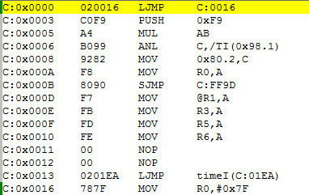

今天上无线传感器网络课的时候，老师问了一个他遇到的问题：用C语言编写中断程序时，`interrupt`后跟的数字写错了，但实际运行时却是正常的，他进一步试验发现只要这个数字比正确的数字大都是可以的，由此问我们其中的原因。

听到这个问题我首先想到了中断响应时，单片机所做的工作。其中关键的一步就是根据中断类型跳转到相应的中断向量，然后程序就从这个中断向量继续向下执行。而上述问题的答案也就是在此，为了便于说明，我将定时器0的中断程序改成`interrupt 1`->`interrupt 2`，编译后的汇编代码如图所示：

由图可知中断跳转语句`C:0x0013 0201EA LJMP timeI(C:01EA)`是放置在`0x0013`的地址上的，而这个地址正是中断号为2的中断向量，由此可知关键词`interrupt`的作用是在编译时根据编写的中断号在相应的中断向量中放置一条跳转指令，跳转至定义的函数入口。

下面开始分析当`interrupt num`中，`num`写错时的情况，当发生中断时，PC被指向相应的中断向量并由此开始向下执行。可能的错误情况有（假设程序中只有一个中断服务程序）：

1. `num`<正确值

    PC指向的地址大于放置跳转指令的地址，即跳转指令永远执行不到，所以永远进不了中断服务程序。

2. `num`>正确值

    PC指向的地址小于放置跳转指令的地址，即程序可以执行到跳转指令，并进入中断服务程序，只是可能会比正确的慢几个机器周期。

但是，这不是绝对的，有时中断服务程序较短时，编译器会将服务程序的相应指令直接放置在以中断向量开始的区域内，并覆盖掉没有用到的且中断号比它大的中断向量，这种情况下程序还是不会正常执行。

觉得写得还是不够明白，虽然自己心里已经明白其中的原因，但表达方面还是不行，估计是水平还不够。