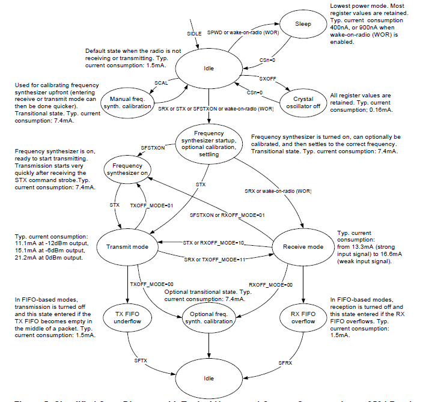

拖来拖去就拖到现在了，什么都没弄，趁现在临阵抱一下佛脚吧。

#####1. CC2500模块
用的是现成淘宝买的模块，从它的芯片手册中知道
>CC2500是一种低成本的2.4GHz收发器，集成了一个数据传输率可达500kbps的高度可配置的调制解调器，并为数据包处理、数据缓冲、突发数据传输、清晰信道评估、连接质量指示和电磁波激发提供广泛的硬件支持。

虽然芯片手册说的好像很厉害的样子，但对我来说完全没感觉，手册后面各种专业术语也根本就是对牛弹琴，对我有用的我想就是这幅图了

上图描述了CC2500工作状态的转换过程。

#####2. GPRS模块

#####3. 单片机的选择

#####4. 数据库的设计

列名             |描述   |数据类型           |允许空值 |说明
--------------- | -----|----------------- |------  |-----
SensorID        |节点ID |uniqueidentifier  |NO      |主键
PH              |ph值   |nvarchar(256)     |NO      |-
temperature     |温度   |nvarchar(256)     |NO      |-
Dissolved_oxygen|溶解氧 |nvarchar(256)     |NO      |-
