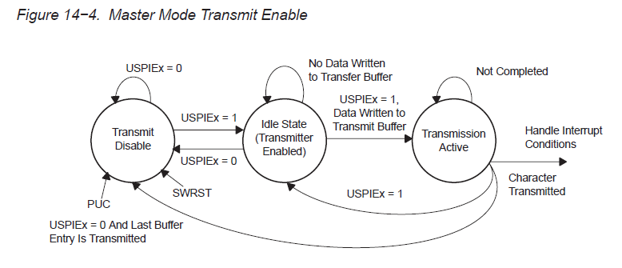

本篇记录最近调试基于MSP430的CC1101射频通信程序中遇到的问题和需要注意的地方。

1. MSP430的硬件SPI部分

	CC1101与MSP430间的通信通过SPI接口，程序使用MSP430的硬件SPI接口，需要配置相应的寄存器。其中我犯的错误是在配置完寄存器后没有置位USPIEx，关于SPI接口的状态转换图如下：
	另外，关于MSP430对IO口复用设置的问题，对于SPI需要设置P3.1、P3.2、P3.3为SPI功能，分别对应SIMO0、SOMI0、UCLK0，其中SOMI0从数据的流向上来说是输入，而SIMO0和UCLK0为输出。那设置时要规定引脚的方向吗？数据手册中的这段话给出了答案：

	>Setting PxSELx = 1 does not automatically set the pin direction. Other peripheral module functions may require the PxDIRx bits to be configured according to the direction needed for the module function. See the pin schematics in the device-specific datasheet.

	最后是关于使用非中断方式SPI接口中判断是否发送完毕的检测，照理来说使用IFG1中的UTXIFG0和U0TCTL中的TXEPT都是可以的，但最后还是使用了第二种方法（估计UTXIFG0需要手动清零，未验证）。

2. CC1101常用寄存器

	- PKTCTRL1

	主要设置是否将RSSI和LQI状态字节附加在数据包后，以及是否开启地址检查。

	- PKTCTRL0

	是否开启CRC校验，设置数据包长度配置，当为可变长时同步词汇后的第一个位配置数据包长度。

	- MCSM1

	配置数据包发送或被接收后CC1101进入什么状态。

----------------------
2014-06-08

补充：发现调试到最后加点延时就成功了，然后再把添加的延时注释掉程序依然正常运行，这该如何是好。。。。

插入延时的位置：

1. 设置完寄存器后
2. 写TXFIFO后
3. `while(!GDO0);while(GDO0);`后
4. 每次发送或接收完后