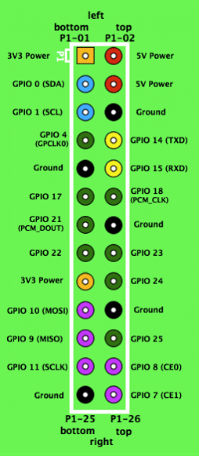

通过树莓派的GPIO连接usb转串口模块连接电脑，通过Putty登录树莓派

连接方式为

usb转串口模块|树莓派GPIO
----------|----------
TXD       |RXD(GPIO15)
RXD       |TXD(GPIO14)

电源和地的话可接可不接

Putty设置com口，波特率为115200
另外最好将Putty的编码改为utf-8

参考[通过串口连接控制树莓派](http://www.cnblogs.com/ma6174/archive/2013/04/23/3038626.html)